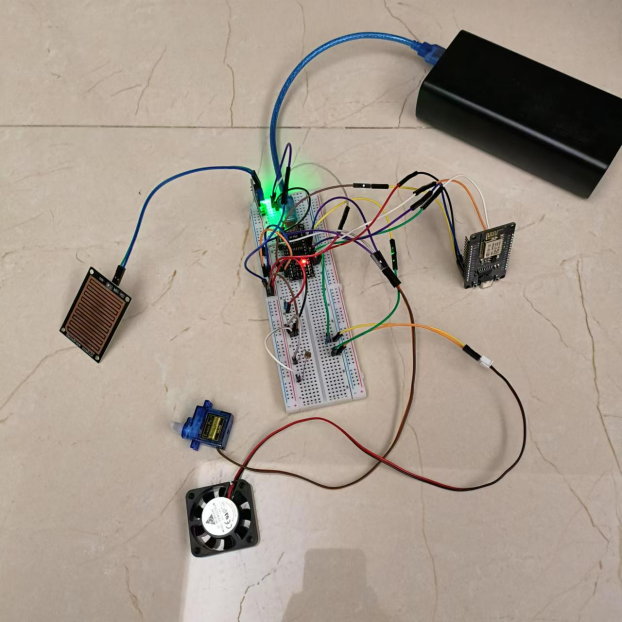
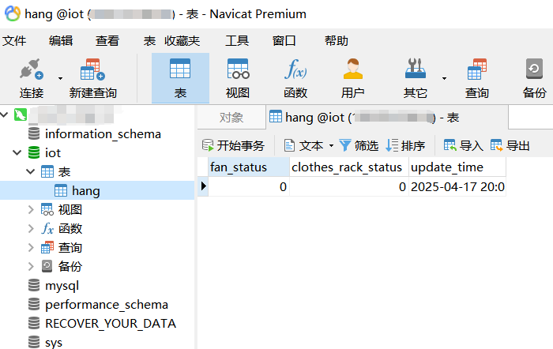

# 智能物联网晾衣杆

### 文件路径说明

```
hang
|
├── hang_app			Flutter前端
|
├── ─── lib/servies		请求接口服务
|
├── ─── lib/widgets		前端组件
|
├── ─── main.dark		前端主程序
|
├── img					素材存放点
|
├── iot_api				后端接口
|
├── ─── app.py			后端主程序
|
├── hang.ino			Arduino程序
|
├── iot.hang.sql		MySQL创库创表脚本
|
├── README.md			说明文档
|
└── 服务器操作.md		服务器配置命令
```

### 配置版本

| Java/jdk | 17.0.12 |
| -------- | ------- |
| Flutter  | 3.19.5  |
| Dart     | 3.3.3   |
| Android  | 13      |
| Python   | 3.12.3  |
| Flask    | 3.0.2   |
| Arduino  | 15      |
| MySQL    | 8.0.41  |

<br/>

### 其他注意事项

​	需要阅读**服务器操作 .md**，**hang_app的REAMDE.md**，以及**iot_api的Test.md**、购置价目表。可以使用Navicat连接MySQL后，执行**iot.hang.sql**创库创表。具体操作请参考**服务器操作.md**。




