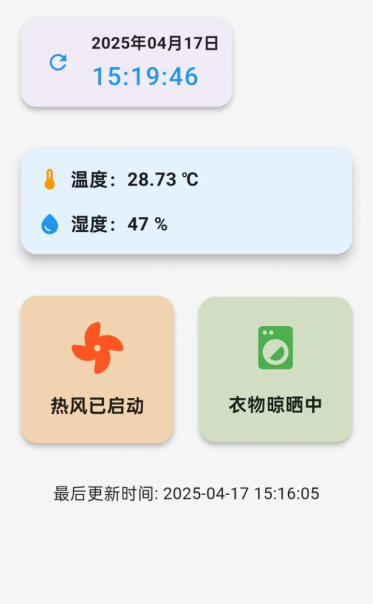

# hang_app

### 文件路径说明

```
hang_app
|
├── lib
|
├── ─── servies					请求接口服务
|
├── ─── ─── services.dart		调用/status 查看状态
|
├── ─── widgets					前端组件
|
├── ─── ─── date_display.dart	显示时间以及刷新按钮
|
├── ─── ─── drying_rack.dart	晾衣杆状态
|
├── ─── ─── fan_show.dart		风扇状态
|
├── ─── ─── temperature_humidity.dart	城市温湿度
|
├── ─── main.dark				前端主程序
|
└── README.md					说明文档
```

<br/>

### 配置版本

| Java/jdk | 17.0.12 |
| -------- | ------- |
| Flutter  | 3.19.5  |
| Dart     | 3.3.3   |
| Android  | 13      |

<br/>

### Flutter 安卓打包

```shell
flutter build apk --release
```

​		打包后的apk安卓安装包为Flutter项目文件夹根目录中的 **build\app\outputs\flutter-apk\app-release.apk** 。

